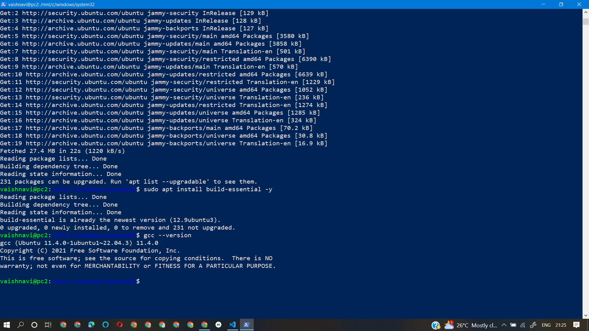
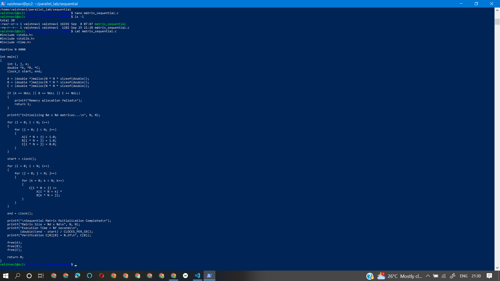
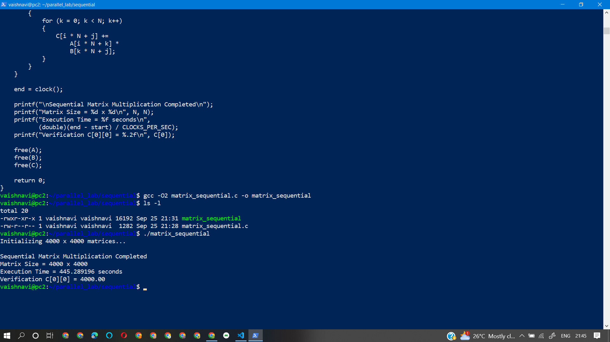

# Experiment 1 - Sequential Matrix Multiplication

## Aim

To implement and execute matrix multiplication sequentially using C and establish a baseline execution time for comparison with parallel implementations.

## Problem Definition

Two matrices `A` and `B` of size `4000 × 4000` are initialized with all elements equal to `1.0`.

The matrix multiplication is performed as:

```text
C = A × B
```

Since every element of `A` and `B` is `1.0`, each element of the resulting matrix `C` is expected to be:

```text
C[i][j] = 4000.00
```

The verification value used is:

```text
C[0][0] = 4000.00
```

## Environment

- Operating System: Windows
- Linux Environment: Ubuntu 22.04.1 LTS using WSL2
- Compiler: GCC 11.4.0
- Programming Language: C
- Matrix Size: 4000 × 4000
- Compilation Optimization: `-O2`

## Procedure

### 1. Verify WSL2

WSL2 was verified using:

```bash
wsl --status
wsl -l -v
```

Ubuntu was available with WSL2.

### 2. Start Ubuntu

The Ubuntu environment was started using:

```bash
wsl
```

The experiment was performed inside the Ubuntu WSL2 environment.

### 3. Install and Verify GCC

The Ubuntu package information was updated using:

```bash
sudo apt update
```

The required build tools were installed using:

```bash
sudo apt install build-essential -y
```

GCC was verified using:

```bash
gcc --version
```

The installed compiler version was:

```text
gcc (Ubuntu 11.4.0-1ubuntu1~22.04.3) 11.4.0
```

### 4. Create the Working Directory

A separate directory was created for the sequential experiment:

```bash
mkdir -p ~/parallel_lab/sequential
cd ~/parallel_lab/sequential
```

### 5. Create the Source File

The C source file was created as:

```text
matrix_sequential.c
```

The program initializes two `4000 × 4000` matrices with `1.0`, performs sequential matrix multiplication using three nested loops, measures execution time using `clock()`, verifies the result using `C[0][0]`, and releases the allocated memory.

### 6. Compile the Program

The program was compiled using GCC with `-O2` optimization:

```bash
gcc -O2 matrix_sequential.c -o matrix_sequential
```

The generated executable was verified using:

```bash
ls -l
```

### 7. Execute the Program

The sequential matrix multiplication program was executed using:

```bash
./matrix_sequential
```

The program completed the `4000 × 4000` matrix multiplication successfully.

## Source Code

```c
#include <stdio.h>
#include <stdlib.h>
#include <time.h>

#define N 4000

int main()
{
    int i, j, k;
    double *A, *B, *C;
    clock_t start, end;

    A = (double *)malloc(N * N * sizeof(double));
    B = (double *)malloc(N * N * sizeof(double));
    C = (double *)malloc(N * N * sizeof(double));

    if (A == NULL || B == NULL || C == NULL)
    {
        printf("Memory allocation failed\n");
        return 1;
    }

    printf("Initializing %d x %d matrices...\n", N, N);

    for (i = 0; i < N; i++)
    {
        for (j = 0; j < N; j++)
        {
            A[i * N + j] = 1.0;
            B[i * N + j] = 1.0;
            C[i * N + j] = 0.0;
        }
    }

    start = clock();

    for (i = 0; i < N; i++)
    {
        for (j = 0; j < N; j++)
        {
            for (k = 0; k < N; k++)
            {
                C[i * N + j] +=
                    A[i * N + k] *
                    B[k * N + j];
            }
        }
    }

    end = clock();

    printf("\nSequential Matrix Multiplication Completed\n");
    printf("Matrix Size = %d x %d\n", N, N);
    printf("Execution Time = %f seconds\n",
           (double)(end - start) / CLOCKS_PER_SEC);
    printf("Verification C[0][0] = %.2f\n", C[0]);

    free(A);
    free(B);
    free(C);

    return 0;
}
```

## Screenshots

### 1. GCC Verification

GCC was successfully installed and verified inside the Ubuntu WSL2 environment.



### 2. Source Code

The sequential matrix multiplication source code was created and verified.



### 3. Compilation and Execution Result

The program was compiled successfully and executed for a `4000 × 4000` matrix.



## Result

The sequential matrix multiplication completed successfully with the following result:

```text
Sequential Matrix Multiplication Completed
Matrix Size = 4000 x 4000
Execution Time = 445.28196 seconds
Verification C[0][0] = 4000.00
```

### Execution Time

```text
445.28196 seconds
```

### Verification

```text
C[0][0] = 4000.00
```

## Observation

The sequential implementation performs the matrix multiplication using a single CPU execution flow. The measured execution time provides the baseline for comparison with the OpenMP, MPI, and CUDA implementations.

## Conclusion

The `4000 × 4000` matrix multiplication was successfully implemented and executed using sequential CPU computation.

The output was verified successfully with:

```text
C[0][0] = 4000.00
```

The measured sequential execution time was:

```text
445.28196 seconds
```

This execution time will be used as the baseline for comparing the performance of the parallel implementations.